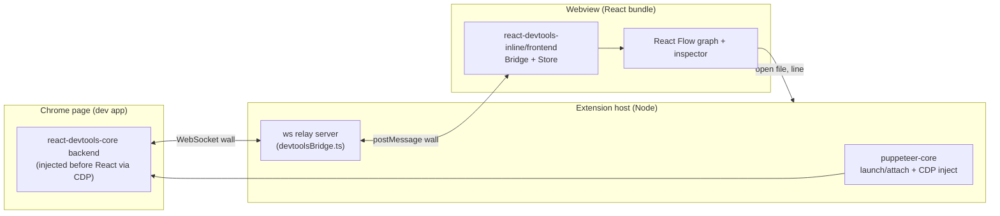

# ReactION — Rearchitecture & Feature Plan

> **Handoff document.** Self-contained so a fresh session (with no prior chat
> context) can execute it. Goal: read a developer's React app and render its
> components **visually and reliably for all component types**, then layer on
> insights (state, re-renders, unused components) that a standalone React
> DevTools can't offer because it doesn't live in the editor.

---

## 1. Context: what exists today

ReactION is a published VS Code extension (`ReactION-js.ReactION`) that
visualizes a running React app's component tree.

**Current pipeline (the part we are replacing):**
1. `src/puppeteer.ts` launches Chrome via `puppeteer-core` at a configured
   `localhost` and **hand-walks React fiber internals** inside `page.evaluate`
   (`_reactRootContainer`, `__reactContainer$`, `__reactFiber$`) to produce a
   flat `RawReactNode[]`.
2. `src/treeSync.ts` **polls** `scrape()` every 1000 ms.
3. `src/TreeNode.ts` builds a hierarchy; posted to the webview via
   `postMessage({ type: 'treeData' })`.
4. `client/` (webpack bundle) renders it with **react-d3-tree**.

**Why rearchitect:** the hand-rolled fiber walk is the core fragility — it
misses iframes/shadow DOM/multiple roots, breaks on production builds, and is
timing-sensitive. Open issues #72 (React 16.9 + react-router v5 → empty tree)
and #73 (large app → empty tree, wants verbose logs) are both "empty tree"
symptoms of this.

**Constraints:**
- Must remain a valid **VS Code / Cursor** extension (Cursor consumes the same
  VSIX; publish to Open VSX later).
- Keep the current "no setup required" selling point (no code changes in the
  developer's app).
- Local version is at `0.2.0` (unpublished); `main` = `out/extension.js`.

**Current file map (extension host `src/`, compiled by tsc → `out/`):**
`extension.ts` (commands + activity bar) · `ViewPanel.ts` / `EmbeddedViewPanel.ts`
(webview panels) · `TreeViewPanel.ts` (HTML/CSP shell) · `puppeteer.ts` (Chrome +
scrape) · `treeSync.ts` (polling) · `TreeNode.ts` (tree model) · `config.ts`
(reactION-config.json loader). Webview (`client/`, webpack + ts-loader →
`out/build/bundle.js`): `App.tsx` · `components/TreeView.tsx` (react-d3-tree) ·
`types.ts`.

---

## 2. Goals & non-goals

**Goals**
- Reliable component tree for **all** React component types (function, class,
  `memo`, `forwardRef`, `lazy`, `Suspense`, context, fragments, portals, hooks)
  across **React 16–19**, including concurrent roots and multiple roots.
- Rich, in-editor insights that fuse **runtime + source**.
- Keep zero-config; bundler-agnostic (CRA/Vite/Next/Remix all just work because
  we drive a real browser at a URL).

**Non-goals (for now)**
- Browser-extension / standalone-app form factor.
- Deep production-build introspection beyond what DevTools exposes.
- Full static dead-code tool (we do a focused subset in Phase 5).

---

## 3. Target architecture

**Principle:** stop hand-walking fibers. Reuse the **official React DevTools
engine** (`react-devtools-core` backend + `react-devtools-inline` frontend
Store), then render our **own** visualization and correlate it with source in
the editor.

**Data flow**
1. Host launches/attaches Chrome (`puppeteer-core`) and uses CDP
   `Page.addScriptToEvaluateOnNewDocument` to inject the DevTools **backend**
   *before any app script runs*, then navigates/reloads.
2. The injected backend installs `__REACT_DEVTOOLS_GLOBAL_HOOK__` (so it must
   run before React initializes) and calls `connectToDevTools({ host, port })`
   to reach our `ws` relay in the host.
3. The host relay forwards the raw "wall" messages to the webview via
   `webview.postMessage`, and forwards webview→host messages back to the socket.
4. The webview builds `react-devtools-inline/frontend` `createBridge(customWall)`
   + `createStore(bridge)` → a **live Store** (the battle-tested element tree).
5. We render our **React Flow** graph from the Store and drive a details panel
   via `bridge.send('inspectElement', id)`.
6. "Jump to source" relays the element's source location to the host →
   `vscode.window.showTextDocument(file, { selection: line })`.

**Critical constraints / gotchas**
- **Hook before React:** inject at new-document time (CDP), then reload. If the
  hook isn't present before React loads, nothing is captured.
- **Version lockstep:** `react-devtools-core` and `react-devtools-inline` share
  the wall/operations protocol — **pin them to identical versions**. Phase 0
  validates protocol compatibility; fallback is to use `react-devtools-inline`
  for *both* sides (bundle its backend into the injected script).
- **CSP:** the webview shell (`TreeViewPanel.ts`) uses a strict nonce CSP; React
  Flow injects styles — allow `style-src` and bundle its CSS.
- **Chrome discovery:** replace the hardcoded `executablePath` reliance with
  robust discovery (`@puppeteer/browsers` / `chrome-launcher`) and an
  attach-to-existing option (`--remote-debugging-port`).

---

## 4. Libraries

| Package | Role | Notes / gotchas |
|---|---|---|
| `react-devtools-core` | DevTools **backend** injected into the page; `connectToDevTools()` over WS | Officially supports "backend connects to a server." **Pin to same version as inline.** |
| `react-devtools-inline` | DevTools **frontend** in the webview: `createBridge`, `createStore`, optional `initialize` UI | Supply a **custom wall** to bridge over postMessage. Store gives the full element tree + profiling. |
| `ws` | Host WebSocket relay server (`devtoolsBridge.ts`) | Node-side only; not bundled into the webview. |
| `puppeteer-core` (existing) | Launch/attach Chrome + CDP injection | Keep. Add `Page.addScriptToEvaluateOnNewDocument`. |
| `@puppeteer/browsers` **or** `chrome-launcher` | Robust Chrome discovery / optional download | Removes the biggest config-fragility. |
| `@xyflow/react` (React Flow v12) | Graph visualization (replaces react-d3-tree) | No built-in layout — pair with a layout lib. Bundle its CSS under the CSP. |
| `@dagrejs/dagre` **or** `elkjs` | Hierarchical/tree layout for React Flow | Dagre = simpler; ELK = nicer for large graphs. |
| `ts-morph` | Static analysis (Phase 5): component/import graph, dead props | Ergonomic TS AST over the compiler API. |
| `react-docgen` | Component + prop metadata for static features | Complements ts-morph; handles common component patterns. |
| `@vscode/test-cli`, `mocha` (existing) | Unit + e2e tests | Add recorded-operations fixtures + sample apps. |

**Removed:** `react-d3-tree` (replaced by React Flow). The bespoke fiber walk in
`puppeteer.ts` and the flat `RawReactNode`/`TreeNode` model are superseded by the
DevTools Store.

---

## 5. Feature set

Legend — **Source:** RT = runtime DevTools engine, ST = static AST, HY = hybrid.
**Effort:** S/M/L.

| Feature | Value | Source | Effort | Caveats |
|---|---|---|---|---|
| **Component graph (all types)** | Core; reliable tree | RT | M | Foundation for everything else |
| Live props / state / hooks | Debugging staple | RT | S | Free from `inspectElement` |
| **Re-render reasons** ("prop X changed") | Top perf pain point | RT | M | Needs profiler "changeDescriptions" capture |
| **Wasted re-render flags** (memo candidates) | High ROI | RT | M | Compare commit output/props |
| **Render-count heatmap** on graph | Visually differentiating, cheap | RT | S | Derive counts from commits/operations |
| State-change **timeline / time-travel** | Original roadmap item | RT | L | Buffer commits; scrub UI |
| **Context provider/consumer map** | Unique; refactor aid | RT | M | Correlate context objects across elements |
| Search / filter tree (by name/type/"has state") | DX baseline | RT | S | — |
| Snapshot **diff** (mounted/updated/unmounted) | Interaction insight | RT | M | Diff two Store snapshots |
| **"Not rendered this session"** components | The IDE moat | HY | M | Frame as coverage, not absolute dead code |
| Session **coverage** (components/routes hit) | UI coverage | HY | M | Depends on what the dev exercised |
| **Bidirectional source ↔ live instance** | IDE moat | HY | M | Uses fiber `_debugSource` (dev builds) |
| **Unused components** (defined, never referenced) | Cleanup | ST | M | Fuzzy: dynamic import, barrels, conditional render |
| **Dead props** (declared, never used) | Cleanup | ST | M | AST per component |
| **Prop drilling → "use context"** | Actionable refactor | ST | L | Thread a prop through N unused layers |
| Dependency graph / "god components" | Architecture insight | ST | M | Fan-in/out metrics |

**Agreed shortlist (build these first, ordered by ROI):**
1. Re-render reasons + wasted-render flags (RT)
2. Render-count heatmap (RT)
3. Context provider/consumer map (RT)
4. "Not rendered this session" + jump-to-source (HY)
5. Prop drilling → context suggestion (ST)

---

## 6. Phased implementation

### Phase 0 — De-risk spike (BLOCKING) — ✅ DONE

**Status:** complete and verified. Spike lives in `spike/` (`run-spike.js` +
`sample-app.jsx`); re-run with `npm run spike`. Result: the Store reports
`numElements = 9` reliably (3/3 runs) and again after a full reload, with
`protocol mismatch = false`. It captures Function / Context / Class / `memo` /
`forwardRef` components (host DOM nodes are hidden by the Store's default
filters). **Core + inline `8.0.0` mix cleanly — the inline-for-both fallback is
not needed.**

Two implementation notes carried into Phase 1:
- Inject with puppeteer's **`page.evaluateOnNewDocument`** (a manually-created
  `createCDPSession` + `Page.addScriptToEvaluateOnNewDocument` did **not** take
  effect in this setup).
- The injected connect script must call **`initialize()` first** (installs
  `__REACT_DEVTOOLS_GLOBAL_HOOK__`: `hookBefore=false → hookNow=true`) **then**
  `connectToDevTools({ host, port })` — both before React runs.
- `react-devtools-core/dist/backend.js` is a **browser UMD** (bare `self`) that
  defines `window.ReactDevToolsBackend`; read it from `node_modules` and inject —
  never `require()` it in Node. `react-devtools-inline/frontend` *does* load in
  Node once JSDOM globals exist (Node 22's `navigator`/`localStorage` are
  getter-only → `Object.defineProperty` / reuse jsdom's).

Validate the protocol path before committing to the rewrite.
- Add deps: `react-devtools-core`, `react-devtools-inline`, `ws`, `@xyflow/react`,
  a layout lib. Pin core & inline to identical versions.
- Script a throwaway: launch Chrome (puppeteer-core), inject the backend via
  `Page.addScriptToEvaluateOnNewDocument`, run a `ws` relay, build a frontend
  `Store` in a Node/JSDOM or a minimal webview, assert `store.numElements > 0`
  against a sample app.
- **Verify:** element count > 0 for a CRA app; backend reconnects after reload.
- **Exit criteria:** protocol round-trips reliably; if core+inline mixing fails,
  switch to inline-for-both and re-validate.

### Phase 1 — Reliable runtime pipeline (replaces fiber scraper) — ✅ DONE

**Status:** complete and verified. The hand-rolled fiber scraper is gone; the
pipeline now runs the official DevTools protocol end-to-end.
- `src/devtoolsBridge.ts` — `ws` relay (host ↔ page ↔ webview), deliberately
  `vscode`-free so it is unit-testable in Node; a fresh socket per connection
  (page reload = reconnect).
- `src/bridgeWiring.ts` — `wireBridgeToWebview()` bridges host postMessage ↔ the
  page socket, plus `backend-connected` / `backend-disconnected` notifications.
- `src/puppeteer.ts` — `start(relayPort)` injects the backend via
  `evaluateOnNewDocument` (`initialize()` → `connectToDevTools`) then
  `gotoWithRetry` (waits for a booting dev server); `scrape()` / `findRootFiber`
  deleted.
- `client/storeBridge.ts` — builds `createBridge` + `createStore` over a
  postMessage wall and projects the Store into the tree; resets on reconnect
  **without** `bridge.shutdown()` (which would post a `shutdown` wall message and
  kill the freshly-reconnected backend — the key bug the harness caught).
- Deleted `src/treeSync.ts` (polling) and `src/TreeNode.ts` (host tree model);
  panels wire the bridge instead of `startTreeSync`.

**Verification** (`npm run spike:phase1`, a harness over the *real* compiled
modules): the Store populates (9 elements) on initial load via the real
`Puppeteer` + `DevtoolsBridge`, and again after a full reload. `compile`, `lint`,
`build:webview`, and `npm test` are all green. (Also fixed two latent repo issues
surfaced along the way: eslint now ignores `.vscode-test/`, and the extension test
opens a workspace folder and activates the extension.) Full F5 against live
CRA/React17/Vite/Next apps is deferred to Phase 4's matrix (no VS Code UI here).

Original spec for this phase:
- New `src/devtoolsBridge.ts`: `ws` server + wall relay (host ↔ page ↔ webview);
  lifecycle (start/stop, reconnect, port allocation).
- Rework `src/puppeteer.ts`: keep launch/attach; **delete** `scrape()` /
  `findRootFiber`; add backend injection, robust Chrome discovery, wait-for-dev-
  server, reload-to-ensure-hook-first.
- Remove polling in `src/treeSync.ts`; drive updates from Store/bridge events.
- Wire `ViewPanel.ts` / `EmbeddedViewPanel.ts` to the bridge instead of
  `startTreeSync`.
- **Verify:** Store populates for CRA (16.13), React 17, Vite (18), Next (19).

### Phase 2 — Visualization on the Store
- `client/App.tsx`: build `createBridge(customWall)` + `createStore`; subscribe
  to Store mutations; map Store elements → graph nodes (covers all types).
- Replace `client/components/TreeView.tsx` (react-d3-tree) with **React Flow** +
  layout (dagre/elk): zoom/pan/collapse, search/filter, virtualization for large
  trees; keep light/dark theme.
- Add **render-count heatmap** (color nodes by commit frequency).
- Adjust `src/TreeViewPanel.ts` CSP for React Flow styles.
- **Verify:** large trees render smoothly; every component type labeled
  correctly; search works.

### Phase 3 — Inspection, re-render insight & jump-to-source
- Details panel via `bridge.send('inspectElement', id)` → props/state/hooks.
- Enable profiler capture → **re-render reasons** + **wasted-render** flags.
- **Context provider/consumer map** from element context data.
- **Jump to source:** relay `_debugSource` → host →
  `vscode.window.showTextDocument`.
- **Verify:** props/state/hooks show; re-render reasons correct on a counter demo;
  clicking a node opens the right file/line.

### Phase 4 — Stability, diagnostics, tests, docs
- Clear "No React detected" empty state + an **Output channel** log (closes #73).
- Reconnect on navigation/HMR; handle multiple roots; auto dev-server URL
  detection (config + scan 3000/5173/8080 + wait).
- Tests: unit the Store→graph transform with **recorded operations fixtures**;
  e2e matrix across React 16–19 + **react-router v5 + React 16.9** (closes #72)
  and v6.
- Update `README.md` / roadmap; refresh screenshots.

### Phase 5 — Static hybrid (source-aware features)
- `src/staticAnalysis.ts` (ts-morph + react-docgen): build the component/import
  graph; compute **unused components**, **dead props**, **prop drilling**,
  dependency metrics.
- Fuse with runtime: **"not rendered this session" = defined − ever-rendered**;
  session **coverage**; bidirectional source ↔ instance.
- Surface in the webview and as optional editor diagnostics/CodeLens.
- **Verify:** on a sample repo with a deliberately-unused component and a drilled
  prop, both are flagged; no false "delete" on dynamically-imported components.

---

## 7. Feature → phase mapping

- **Phase 2:** component graph, search/filter, render-count heatmap.
- **Phase 3:** props/state/hooks, re-render reasons, wasted renders, context map,
  jump-to-source, snapshot diff (if time).
- **Phase 4:** diagnostics/empty-state, reconnect, tests.
- **Phase 5:** unused/"not-rendered", coverage, dead props, prop drilling,
  dependency graph.

---

## 8. Testing strategy

**Sample-app matrix** (keep tiny, commit under `samples/` or reference repos):
- CRA React 16.13 · React 17 · Vite React 18 · Next 15 React 19
- **react-router v5 + React 16.9** (issue #72) · react-router v6
- A "kitchen-sink" app exercising memo/forwardRef/lazy/Suspense/context/portals
  and one deliberately-unused component + one drilled prop (for Phase 5).

**Commands:** `npm run compile` · `npm run build:webview` · `npm run lint` ·
`npm test` · `npm run test:e2e` (set `CHROME_PATH` / `REACTION_APP_URL`).

**Unit:** record real DevTools "operations" from a session, replay them through
the Store→graph transform, assert node shape/types. **E2E:** F5 → open each
sample → assert tree renders, all types present, props/state/hooks, jump-to-
source, and the empty state when no React is found.

---

## 9. Risks & mitigations

| Risk | Mitigation |
|---|---|
| Backend/frontend protocol version mismatch | Pin core+inline identical; Phase 0 validates; fallback inline-for-both |
| Hook not installed before React | CDP `addScriptToEvaluateOnNewDocument` + reload |
| React Flow perf on huge trees | Virtualize; collapse by default; layout off the main thread if needed |
| Chrome path fragility | `@puppeteer/browsers` discovery + attach-to-existing |
| Static "unused" false positives | Frame as coverage; combine with runtime; respect dynamic imports/barrels |
| CSP blocks webview libs | Bundle CSS; extend `style-src`; keep nonce for scripts |
| Production builds strip names/source | Detect + message; recommend dev build for full detail |

---

## 10. First tasks for the fresh session

1. Read this file and `/memories/repo/reaction.md`.
2. Do the **Phase 0 spike** end-to-end before touching production code.
3. Only after the spike round-trips a populated Store, start Phase 1.
4. Keep each phase independently shippable and green
   (`compile` + `build:webview` + `lint` + `test`).

---

## 11. Open questions for the user

1. **Visualization:** custom React Flow graph (recommended, differentiated) vs.
   embedding the stock DevTools UI (less work, less distinctive)?
2. **Chrome:** launch (current) vs. attach-to-existing vs. bundle Chromium?
   (Recommended: attach-or-launch with robust discovery.)
3. **Static features scope:** ship the full Phase 5 set or just
   "not-rendered-this-session" first?
4. **Sample apps:** commit small ones into the repo, or point tests at external
   fixtures?

---

## 12. References

- React DevTools packages: `react-devtools-core`, `react-devtools-inline`
  (react/react-devtools monorepo). Study `connectToDevTools`, `createBridge`,
  `createStore`, and the backend `initialize`/`activate` APIs.
- React Flow: `@xyflow/react` v12 docs (custom nodes, layout with dagre/elk).
- CDP: `Page.addScriptToEvaluateOnNewDocument` for pre-React injection.
