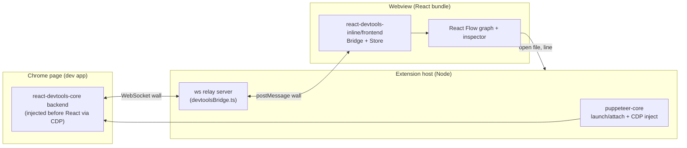

# ReactION — Rearchitecture & Feature Plan

> **Handoff document.** Self-contained so a fresh session (with no prior chat
> context) can execute it. Goal: read a developer's React app and render its
> components **visually and reliably for all component types**, then layer on
> insights (state, re-renders, unused components) that a standalone React
> DevTools can't offer because it doesn't live in the editor.

---

## 1. Context: what exists today

ReactION is a published VS Code extension (`ReactION-js.ReactION`) that
visualizes a running React app's component tree.

**Current pipeline (the part we are replacing):**

1. `src/puppeteer.ts` launches Chrome via `puppeteer-core` at a configured
   `localhost` and **hand-walks React fiber internals** inside `page.evaluate`
   (`_reactRootContainer`, `__reactContainer$`, `__reactFiber$`) to produce a
   flat `RawReactNode[]`.
2. `src/treeSync.ts` **polls** `scrape()` every 1000 ms.
3. `src/TreeNode.ts` builds a hierarchy; posted to the webview via
   `postMessage({ type: 'treeData' })`.
4. `client/` (webpack bundle) renders it with **react-d3-tree**.

**Why rearchitect:** the hand-rolled fiber walk is the core fragility — it
misses iframes/shadow DOM/multiple roots, breaks on production builds, and is
timing-sensitive. Open issues #72 (React 16.9 + react-router v5 → empty tree)
and #73 (large app → empty tree, wants verbose logs) are both "empty tree"
symptoms of this.

**Constraints:**

- Must remain a valid **VS Code / Cursor** extension (Cursor consumes the same
  VSIX; publish to Open VSX later).
- Keep the current "no setup required" selling point (no code changes in the
  developer's app).
- Local version is at `0.2.0` (unpublished); `main` = `out/extension.js`.

**Current file map (extension host `src/`, compiled by tsc → `out/`):**
`extension.ts` (commands + activity bar) · `ViewPanel.ts` / `EmbeddedViewPanel.ts`
(webview panels) · `TreeViewPanel.ts` (HTML/CSP shell) · `puppeteer.ts` (Chrome +
scrape) · `treeSync.ts` (polling) · `TreeNode.ts` (tree model) · `config.ts`
(reactION-config.json loader). Webview (`client/`, webpack + ts-loader →
`out/build/bundle.js`): `App.tsx` · `components/TreeView.tsx` (react-d3-tree) ·
`types.ts`.

---

## 2. Goals & non-goals

**Goals**

- Reliable component tree for **all** React component types (function, class,
  `memo`, `forwardRef`, `lazy`, `Suspense`, context, fragments, portals, hooks)
  across **React 16–19**, including concurrent roots and multiple roots.
- Rich, in-editor insights that fuse **runtime + source**.
- Keep zero-config; bundler-agnostic (CRA/Vite/Next/Remix all just work because
  we drive a real browser at a URL).

**Non-goals (for now)**

- Browser-extension / standalone-app form factor.
- Deep production-build introspection beyond what DevTools exposes.
- Full static dead-code tool (we do a focused subset in Phase 5).

---

## 3. Target architecture

**Principle:** stop hand-walking fibers. Reuse the **official React DevTools
engine** (`react-devtools-core` backend + `react-devtools-inline` frontend
Store), then render our **own** visualization and correlate it with source in
the editor.

**Data flow**

1. Host launches/attaches Chrome (`puppeteer-core`) and uses CDP
   `Page.addScriptToEvaluateOnNewDocument` to inject the DevTools **backend**
   _before any app script runs_, then navigates/reloads.
2. The injected backend installs `__REACT_DEVTOOLS_GLOBAL_HOOK__` (so it must
   run before React initializes) and calls `connectToDevTools({ host, port })`
   to reach our `ws` relay in the host.
3. The host relay forwards the raw "wall" messages to the webview via
   `webview.postMessage`, and forwards webview→host messages back to the socket.
4. The webview builds `react-devtools-inline/frontend` `createBridge(customWall)`
   - `createStore(bridge)` → a **live Store** (the battle-tested element tree).
5. We render our **React Flow** graph from the Store and drive a details panel
   via `bridge.send('inspectElement', id)`.
6. "Jump to source" relays the element's source location to the host →
   `vscode.window.showTextDocument(file, { selection: line })`.

**Critical constraints / gotchas**

- **Hook before React:** inject at new-document time (CDP), then reload. If the
  hook isn't present before React loads, nothing is captured.
- **Version lockstep:** `react-devtools-core` and `react-devtools-inline` share
  the wall/operations protocol — **pin them to identical versions**. Phase 0
  validates protocol compatibility; fallback is to use `react-devtools-inline`
  for _both_ sides (bundle its backend into the injected script).
- **CSP:** the webview shell (`TreeViewPanel.ts`) uses a strict nonce CSP; React
  Flow injects styles — allow `style-src` and bundle its CSS.
- **Chrome discovery:** replace the hardcoded `executablePath` reliance with
  robust discovery (`@puppeteer/browsers` / `chrome-launcher`) and an
  attach-to-existing option (`--remote-debugging-port`).

---

## 4. Libraries

| Package                                        | Role                                                                                          | Notes / gotchas                                                                                     |
| ---------------------------------------------- | --------------------------------------------------------------------------------------------- | --------------------------------------------------------------------------------------------------- |
| `react-devtools-core`                          | DevTools **backend** injected into the page; `connectToDevTools()` over WS                    | Officially supports "backend connects to a server." **Pin to same version as inline.**              |
| `react-devtools-inline`                        | DevTools **frontend** in the webview: `createBridge`, `createStore`, optional `initialize` UI | Supply a **custom wall** to bridge over postMessage. Store gives the full element tree + profiling. |
| `ws`                                           | Host WebSocket relay server (`devtoolsBridge.ts`)                                             | Node-side only; not bundled into the webview.                                                       |
| `puppeteer-core` (existing)                    | Launch/attach Chrome + CDP injection                                                          | Keep. Add `Page.addScriptToEvaluateOnNewDocument`.                                                  |
| `@puppeteer/browsers` **or** `chrome-launcher` | Robust Chrome discovery / optional download                                                   | Removes the biggest config-fragility.                                                               |
| `@xyflow/react` (React Flow v12)               | Graph visualization (replaces react-d3-tree)                                                  | No built-in layout — pair with a layout lib. Bundle its CSS under the CSP.                          |
| `@dagrejs/dagre` **or** `elkjs`                | Hierarchical/tree layout for React Flow                                                       | Dagre = simpler; ELK = nicer for large graphs.                                                      |
| `ts-morph`                                     | Static analysis (Phase 5): component/import graph, dead props                                 | Ergonomic TS AST over the compiler API.                                                             |
| `react-docgen`                                 | Component + prop metadata for static features                                                 | Complements ts-morph; handles common component patterns.                                            |
| `@vscode/test-cli`, `mocha` (existing)         | Unit + e2e tests                                                                              | Add recorded-operations fixtures + sample apps.                                                     |

**Removed:** `react-d3-tree` (replaced by React Flow). The bespoke fiber walk in
`puppeteer.ts` and the flat `RawReactNode`/`TreeNode` model are superseded by the
DevTools Store.

---

## 5. Feature set

Legend — **Source:** RT = runtime DevTools engine, ST = static AST, HY = hybrid.
**Effort:** S/M/L.

| Feature                                           | Value                           | Source | Effort | Caveats                                                                        |
| ------------------------------------------------- | ------------------------------- | ------ | ------ | ------------------------------------------------------------------------------ |
| **Component graph (all types)**                   | Core; reliable tree             | RT     | M      | Foundation for everything else                                                 |
| Live props / state / hooks                        | Debugging staple                | RT     | S      | Free from `inspectElement`                                                     |
| **Re-render reasons** ("prop X changed")          | Top perf pain point             | RT     | M      | Needs profiler "changeDescriptions" capture                                    |
| **Wasted re-render flags** (memo candidates)      | High ROI                        | RT     | M      | Compare commit output/props                                                    |
| **Render-count heatmap** on graph                 | Visually differentiating, cheap | RT     | M      | Needs profiler per-commit data, not just tree operations (see §6 Phase 2 note) |
| State-change **timeline / time-travel**           | Original roadmap item           | RT     | L      | Buffer commits; scrub UI                                                       |
| **Context provider/consumer map**                 | Unique; refactor aid            | RT     | M      | Correlate context objects across elements                                      |
| Search / filter tree (by name/type/"has state")   | DX baseline                     | RT     | S      | —                                                                              |
| Snapshot **diff** (mounted/updated/unmounted)     | Interaction insight             | RT     | M      | Diff two Store snapshots                                                       |
| **"Not rendered this session"** components        | The IDE moat                    | HY     | M      | Frame as coverage, not absolute dead code                                      |
| Session **coverage** (components/routes hit)      | UI coverage                     | HY     | M      | Depends on what the dev exercised                                              |
| **Bidirectional source ↔ live instance**          | IDE moat                        | HY     | M      | Uses fiber `_debugSource` (dev builds)                                         |
| **Unused components** (defined, never referenced) | Cleanup                         | ST     | M      | Fuzzy: dynamic import, barrels, conditional render                             |
| **Dead props** (declared, never used)             | Cleanup                         | ST     | M      | AST per component                                                              |
| **Prop drilling → "use context"**                 | Actionable refactor             | ST     | L      | Thread a prop through N unused layers                                          |
| Dependency graph / "god components"               | Architecture insight            | ST     | M      | Fan-in/out metrics                                                             |

**Agreed shortlist (build these first, ordered by ROI):**

1. Re-render reasons + wasted-render flags (RT)
2. Render-count heatmap (RT)
3. Context provider/consumer map (RT)
4. "Not rendered this session" + jump-to-source (HY)
5. Prop drilling → context suggestion (ST)

---

## 6. Phased implementation

### Phase 0 — De-risk spike (BLOCKING) — ✅ DONE

**Status:** complete and verified. Spike lives in `spike/` (`run-spike.js` +
`sample-app.jsx`); re-run with `npm run spike`. Result: the Store reports
`numElements = 9` reliably (3/3 runs) and again after a full reload, with
`protocol mismatch = false`. It captures Function / Context / Class / `memo` /
`forwardRef` components (host DOM nodes are hidden by the Store's default
filters). **Core + inline `8.0.0` mix cleanly — the inline-for-both fallback is
not needed.**

Two implementation notes carried into Phase 1:

- Inject with puppeteer's **`page.evaluateOnNewDocument`** (a manually-created
  `createCDPSession` + `Page.addScriptToEvaluateOnNewDocument` did **not** take
  effect in this setup).
- The injected connect script must call **`initialize()` first** (installs
  `__REACT_DEVTOOLS_GLOBAL_HOOK__`: `hookBefore=false → hookNow=true`) **then**
  `connectToDevTools({ host, port })` — both before React runs.
- `react-devtools-core/dist/backend.js` is a **browser UMD** (bare `self`) that
  defines `window.ReactDevToolsBackend`; read it from `node_modules` and inject —
  never `require()` it in Node. `react-devtools-inline/frontend` _does_ load in
  Node once JSDOM globals exist (Node 22's `navigator`/`localStorage` are
  getter-only → `Object.defineProperty` / reuse jsdom's).

Validate the protocol path before committing to the rewrite.

- Add deps: `react-devtools-core`, `react-devtools-inline`, `ws`, `@xyflow/react`,
  a layout lib. Pin core & inline to identical versions.
- Script a throwaway: launch Chrome (puppeteer-core), inject the backend via
  `Page.addScriptToEvaluateOnNewDocument`, run a `ws` relay, build a frontend
  `Store` in a Node/JSDOM or a minimal webview, assert `store.numElements > 0`
  against a sample app.
- **Verify:** element count > 0 for a CRA app; backend reconnects after reload.
- **Exit criteria:** protocol round-trips reliably; if core+inline mixing fails,
  switch to inline-for-both and re-validate.

### Phase 1 — Reliable runtime pipeline (replaces fiber scraper) — ✅ DONE

**Status:** complete and verified. The hand-rolled fiber scraper is gone; the
pipeline now runs the official DevTools protocol end-to-end.

- `src/devtoolsBridge.ts` — `ws` relay (host ↔ page ↔ webview), deliberately
  `vscode`-free so it is unit-testable in Node; a fresh socket per connection
  (page reload = reconnect).
- `src/bridgeWiring.ts` — `wireBridgeToWebview()` bridges host postMessage ↔ the
  page socket, plus `backend-connected` / `backend-disconnected` notifications.
- `src/puppeteer.ts` — `start(relayPort)` injects the backend via
  `evaluateOnNewDocument` (`initialize()` → `connectToDevTools`) then
  `gotoWithRetry` (waits for a booting dev server); `scrape()` / `findRootFiber`
  deleted.
- `client/storeBridge.ts` — builds `createBridge` + `createStore` over a
  postMessage wall and projects the Store into the tree; resets on reconnect
  **without** `bridge.shutdown()` (which would post a `shutdown` wall message and
  kill the freshly-reconnected backend — the key bug the harness caught).
- Deleted `src/treeSync.ts` (polling) and `src/TreeNode.ts` (host tree model);
  panels wire the bridge instead of `startTreeSync`.

**Verification** (`npm run spike:phase1`, a harness over the _real_ compiled
modules): the Store populates (9 elements) on initial load via the real
`Puppeteer` + `DevtoolsBridge`, and again after a full reload. `compile`, `lint`,
`build:webview`, and `npm test` are all green. (Also fixed two latent repo issues
surfaced along the way: eslint now ignores `.vscode-test/`, and the extension test
opens a workspace folder and activates the extension.) Full F5 against live
CRA/React17/Vite/Next apps is deferred to Phase 4's matrix (no VS Code UI here).

Original spec for this phase:

- New `src/devtoolsBridge.ts`: `ws` server + wall relay (host ↔ page ↔ webview);
  lifecycle (start/stop, reconnect, port allocation).
- Rework `src/puppeteer.ts`: keep launch/attach; **delete** `scrape()` /
  `findRootFiber`; add backend injection, robust Chrome discovery, wait-for-dev-
  server, reload-to-ensure-hook-first.
- Remove polling in `src/treeSync.ts`; drive updates from Store/bridge events.
- Wire `ViewPanel.ts` / `EmbeddedViewPanel.ts` to the bridge instead of
  `startTreeSync`.
- **Verify:** Store populates for CRA (16.13), React 17, Vite (18), Next (19).

### Phase 2 — Visualization on the Store — ✅ DONE

**Status:** complete and verified. `react-d3-tree` is gone; the webview renders
the live Store as a **React Flow** graph.

- `client/flowLayout.ts` — flattens the `ComponentNode` tree into React Flow
  nodes/edges and lays them out with `@dagrejs/dagre` (`TB`/`LR` toggle);
  collapsed nodes omit their descendants from the graph.
- `client/components/FlowNode.tsx` — custom node: name, a type badge colored by
  `ElementType` (Function/Class/Memo/ForwardRef/Context/…), and a collapse
  toggle when it has children. `client/components/NodeLabel.tsx` deleted
  (superseded).
- `client/components/TreeView.tsx` — rewritten on `@xyflow/react`
  (`ReactFlow` + `Background`/`Controls`/`MiniMap`), with a search box that dims
  non-matching nodes (kept the "Change orientation" button, now toggling dagre's
  `rankdir`). Same `{data, theme}` props, so `App.tsx` is unchanged.
- `webpack.config.js` — added a `style-loader`/`css-loader` rule so the webview
  bundle can import `@xyflow/react/dist/style.css` and `client/components/flow.css`.
  No CSP change was needed: React Flow's stylesheet has no `url()`/`@font-face`,
  and the existing `style-src 'unsafe-inline'` already covers injected `<style>`
  tags and inline `style=""` attributes.
- Added missing transitive dep `react-is` (required by `react-devtools-inline`'s
  bundle but not declared by it) — `build:webview` failed with `Can't resolve
'react-is'` until added.

**Render-count heatmap — deferred to Phase 3 (plan correction).** Investigating
the actual bundled protocol (`node_modules/react-devtools-core/dist/backend.js`)
showed the base (non-profiling) commit protocol has no operation for "this
component re-rendered with the same props/children" — `Store`'s `'mutated'`
event only reports structurally added/removed element IDs, not per-node commit
counts. A true render-count signal requires the **profiler** (`startProfiling`

- per-commit fiber duration/updater data), which is exactly Phase 3's
  dependency for re-render reasons and wasted-render flags. Building the heatmap
  now would have meant either a fake (always-empty) counter or reinventing
  operations parsing against an unstable internal protocol. Moved to Phase 3
  where it can share the real profiler capture.

**Verification:** `npm run compile`, `lint`, `build:webview` (bundle ~1.02 MiB,
no warnings), and `npm test` are all green. Additionally verified **visually**:
a throwaway harness (`spike/run-phase2-visual.js`) drives the real compiled
`devtoolsBridge.js` + `puppeteer.js` against the sample app and serves the real
`out/build/bundle.js` to a page opened in a live browser — screenshots confirm
the graph renders all component types with correct labels/colors, search dims
non-matches, and collapse/expand hides/shows subtrees correctly.

Original spec for this phase:

- `client/App.tsx`: build `createBridge(customWall)` + `createStore`; subscribe
  to Store mutations; map Store elements → graph nodes (covers all types).
- Replace `client/components/TreeView.tsx` (react-d3-tree) with **React Flow** +
  layout (dagre/elk): zoom/pan/collapse, search/filter, virtualization for large
  trees; keep light/dark theme.
- Add **render-count heatmap** (color nodes by commit frequency).
- Adjust `src/TreeViewPanel.ts` CSP for React Flow styles.
- **Verify:** large trees render smoothly; every component type labeled
  correctly; search works.

### Phase 3 — Inspection, re-render insight & jump-to-source — ✅ DONE

**Status:** complete and verified. Built as four independently-committed,
independently-reviewed sub-phases (3a–3d) rather than one commit, since the
plan bundled four fairly separable features; each sub-phase landed only after
a spec-compliance pass and a code-quality pass both came back clean.

- **3a — element inspection panel.** `client/elementInspection.ts`
  (`ElementInspector`) sends `inspectElement`/listens for `inspectedElement`
  over the Store's existing bridge; click a graph node to select it, poll
  ~1s while selected (`forceFullData:false`, matching the stock DevTools
  panel's own behavior), render Props/State/Hooks in a new
  `client/components/InspectorPanel.tsx` (`ValueTree.tsx` holds the
  recursive value renderer, extracted once the panel grew). Handles the
  protocol's dehydration wrapper (`{data, cleaned, unserializable}`) and
  `hydrated-path` expansion for nested/placeholder values.
- **3b — jump to source.** **Plan correction:** the field is `source`, a
  `[functionName, fileName, lineNumber, columnNumber]` **tuple** — `_debugSource`
  does not exist in this protocol version. Line/column are 1-based (V8
  `CallSite` convention); the host subtracts 1 for `vscode.Position`. New
  `src/openSource.ts` (pure path resolution: absolute / `webpack://`-style /
  relative / unresolvable) + `src/sourceOpeningWiring.ts`
  (`vscode.window.showTextDocument`, graceful failure message otherwise).
  **Security note:** review caught that the raw `fileName` — which
  originates from the *inspected page's own JS runtime* and is therefore
  untrusted — could escape the workspace via `../` traversal, an absolute
  path, or a symlink; closed with a `path.relative`-based containment check
  plus a `fs.realpathSync`-on-both-sides check (realpathing only the
  candidate would false-negative on macOS, where `/var` itself symlinks to
  `/private/var`).
- **3c — profiler capture** (re-render reasons, wasted-render flags,
  render-count heatmap). Uses `store.profilerStore` /
  `store.recordChangeDescriptions` — properties of the `Store` object
  `createStore()` returns, **not** exports of `react-devtools-inline/frontend`
  (that package only exports `createBridge`/`createStore`/`initialize`).
  `recordChangeDescriptions` must be set **before** calling
  `profilerStore.startProfiling()`. Data-ready signal is the
  `'isProcessingData'` event transitioning back to `false` — **not** a
  `'profilingData'` event, which only fires on import/export, never a normal
  live capture. New pure `client/renderStats.ts`
  (`isWastedRender`/`computeRenderCounts`/`describeChange`) + orchestration
  hook `client/useProfiler.ts`. A fiber that fully bails out never appears in
  a commit's `changeDescriptions` at all (same base-protocol gap the Phase 2
  note above already found — the profiler closes it only for fibers that
  actually ran). **Bug caught in review:** `stopProfiling()` relabels the
  toggle synchronously, before the backend's async stop confirmation lands,
  so a plain double-click on "Stop" could re-enter `startProfiling()` and
  silently destroy the just-captured session; closed with a
  `stopConfirmationPending` guard cleared only by the real confirmation
  event.
- **3d — context provider/consumer map.** No context identity exists on the
  wire; correlation is a **documented heuristic**: strip the
  `.Provider`/`.Consumer` suffix from an ancestor's `displayName` and match
  it against a consumer's `useContext` hook name, walking to the *nearest*
  matching ancestor (shadowing). Two distinct `Context` objects sharing a
  displayName (including the common case of an anonymous `createContext()`
  with no `.displayName`, which reports as bare `"Context"`) are
  indistinguishable from Store data alone — out of scope to solve. Only
  function/`memo`/`forwardRef` consumers are covered; class-component legacy
  `contextType`/`this.context` is not. New pure `client/contextMap.ts` +
  `client/useContextMap.ts`, reusing 3a's inspection plumbing via a new
  one-shot `ElementInspector.inspectOnce(id)` (bypasses the selection/poll
  state machine). User-triggered ("Build context map" button), not automatic
  — an eager per-node `inspectElement` fan-out on every Store mutation would
  not scale.

**Verification:** every sub-phase met the existing `compile`+`lint`+
`build:webview`+`test` bar plus a throwaway `spike/run-phase3-*.js` harness
(real Puppeteer + real compiled host modules, following the Phase 1/2
pattern) proving the specific protocol behavior against the shared sample
app (`spike/sample-app.jsx`, unmodified — its existing `Counter`/`Header`/
`ThemeContext` already covered every fixture these sub-phases needed) —
several also cross-checked findings against the real installed
`node_modules/react-devtools-core`/`react-devtools-inline` v8.0.0 source
directly rather than trusting general React DevTools knowledge, since this
plan's own Phase 2 note already showed that knowledge can be
version-specific and wrong.

**Follow-ups for Phase 4, not defects in this work:** `client/useContextMap.ts`'s
`inspectOnce` fan-out has no concurrency cap (fine for a user-triggered
one-off click on the sample-sized trees tested here, but worth throttling
before a real production-sized tree); `client/` logic is still verified only
via ad hoc spike harnesses, never a CI-enforced test runner (`src/` has real
`vscode-test`/mocha coverage, `client/` does not) — the strongest of these
harnesses (e.g. the pure-function fixture suites for `renderStats.ts`/
`contextMap.ts`) would be worth promoting into a real suite as part of
Phase 4's own testing work.

Original spec for this phase:

- Details panel via `bridge.send('inspectElement', id)` → props/state/hooks.
- Enable profiler capture → **re-render reasons** + **wasted-render** flags +
  **render-count heatmap** (moved from Phase 2 — all three need the same
  `startProfiling`/per-commit fiber data; see the Phase 2 note above).
- **Context provider/consumer map** from element context data.
- **Jump to source:** relay `_debugSource` → host →
  `vscode.window.showTextDocument`.
- **Verify:** props/state/hooks show; re-render reasons correct on a counter demo;
  clicking a node opens the right file/line.

### Phase 4 — Stability, diagnostics, tests, docs — ✅ DONE

**Status:** complete and verified. Built as five independently-committed,
independently-reviewed sub-phases (4a–4e), same process as Phase 3. Two
scoping calls were made explicitly before starting, rather than assumed:
the e2e version matrix was scoped to "minimal now" (recorded-fixture unit
tests + one new fixture closing #72, not the full React 16–19 × router v5/v6
matrix from §8), and robust Chrome-executable discovery (`@puppeteer/browsers`/
`chrome-launcher`, originally scoped to Phase 1 but never actually built
there) was explicitly deferred rather than folded in here.

- **4a — diagnostics** (closes #73). A real `vscode.OutputChannel`, threaded
  into `Puppeteer`/`DevtoolsBridge` via an **optional plain-function
  logger** (`src/logging.ts`'s `LogFn`) so both classes keep their existing
  vscode-free, plain-Node-testable design — this is the load-bearing
  constraint for the whole task, not a detail. Splits one generic
  Chrome-launch-failure message into three accurately-worded, distinct
  errors (`ChromeLaunchError`/`DevServerUnreachableError`/
  `BackendInjectionError`, the last one added in review after a real
  uncovered gap between the launch and goto try/catch blocks was found —
  see `src/puppeteer.ts`), each with a "Show Log" action button. A
  client-side empty-state timeout in the webview now shows an actionable
  "No React components detected" message instead of an indefinite
  "Waiting…", relayed to the Output channel too.
- **4b — dev-server resilience.** A cheap plain-HTTP probe
  (`src/devServerProbe.ts`) tries the configured URL first, only falls back
  to scanning `5173`/`8080` if it doesn't answer quickly, and falls back to
  the *original* configured URL (not a fallback) if nothing answers — cold
  start (server still booting) is never made slower. `src/connectionResilience.ts`
  adds a bounded (5-attempt, backoff) reconnect after the dev server
  restarts mid-session, and detects an unexpected Chrome/browser crash
  (`browser.on('disconnected')`) distinctly from an intentional panel
  close — auto-relaunching a whole new browser after a crash was
  explicitly left out of scope; a crash surfaces a warning telling the user
  to reopen the panel instead. This was the highest concurrency-risk task
  in the phase (retry/backoff loops, a real `SIGKILL`-the-launched-Chrome
  test); review traced the state machine by hand and found it correct, then
  still asked for a documented no-throw contract on `reconnect()` plus a
  real Chrome-gated regression test, since the only prior coverage was a
  throwaway harness.
- **4c — recorded-operations-fixture tests + multi-root verification.** The
  first task to promote a spike-harness-style check into a real, permanent,
  checked-in mocha test (`spike/storeGraphTransform.test.js`, wired into
  `test:e2e`) — it replays a captured `sample-app-operations.json` fixture
  through the real `client/storeBridge.ts`/`client/flowLayout.ts` transform
  with **zero live Chrome/network**, closing a gap the end of Phase 3 had
  flagged (`client/` had no CI-runnable tests, only spike scripts). Also
  verified `buildTree`'s existing-but-previously-untested multi-root
  wrapper against a new dedicated two-root fixture app (not the shared
  `sample-app.jsx`). Extracted the esbuild-compile-and-require + JSDOM
  bootstrap boilerplate — duplicated across every spike harness — into
  `spike/testHarness.js` once it was clear a permanent test needed the same
  technique a fourth time.
- **4d — react-router v5 fixture, closes #72.** An isolated fixture
  (`spike/fixtures/router-v5-app/`, its own `package.json` + nested
  `node_modules` pinning the reporter's exact versions —
  `react@16.9.0`/`react-dom@16.9.0`/`react-router-dom@5.0.1` — with **zero**
  changes to the root project's dependencies) proves the new
  DevTools-protocol pipeline populates the Store correctly for the exact
  combination that produced an empty tree under the old fiber-walking
  approach. The root `.gitignore`'s `/node_modules` pattern turned out to
  be root-anchored only and didn't cover this nested one — a real gap,
  fixed (`/spike/fixtures/**/node_modules`). React-version resolution
  (16.9, not the root project's 19) was verified two ways: reading the
  fixture's own installed `package.json` files, and grepping the actual
  bundled JS for React's baked-in version string.
- **4e — docs.** `README.md`'s architecture description, feature list,
  "Built With", and roadmap were all still describing the pre-Phase-0
  fiber-walking/react-d3-tree pipeline; rewritten against the actual
  current code rather than this plan's forward-looking language, including
  an honest Limitations section (production-build detection, the context
  map's displayName-collision heuristic, no legacy class-component context,
  no time-travel UI). `CHANGELOG.md`'s unpublished `0.2.0` entry claimed
  fiber-tree scraping had been extended — it was deleted, not extended;
  corrected. Screenshot refreshed to the current React Flow UI; the stale
  demo GIF was unreferenced rather than faked (recording a good interaction
  GIF was explicitly left as a manual follow-up).

**Verification:** every sub-phase met the same `compile`+`lint`+
`build:webview`+`test` bar as Phase 3, plus for 4b/4c/4d a live-Puppeteer
harness against real Chrome proving the specific behavior (dev-server
kill/revive, a real `SIGKILL` of the launched Chrome PID, a real captured
protocol fixture, the router-v5 reproduction) — the same "verify against
real installed behavior, not assumption" discipline Phase 3 established.
Every regression harness from every prior phase was re-run **unmodified**
after each sub-phase and confirmed still passing, including through 4c's
addition of a permanent CI test and 4d's isolated second dependency tree.

**Follow-ups, not defects in this work:** the react-router **v6** half of
§8's matrix, and the full React 16–19 CRA/Vite/Next matrix, remain
un-built per the explicit "minimal now" scoping decision; Chrome-executable
discovery (robust binary discovery + attach-to-existing) remains deferred
per the explicit decision not to fold it into this phase; a bounded timeout
for `connectionResilience.ts`'s `stopConfirmationPending`-style pending
state was suggested (fail-closed on a permanently-hung backend
confirmation is the current, deliberate trade-off); the demo GIF needs a
manual re-recording.

### Phase 5 — Static hybrid (source-aware features)

- `src/staticAnalysis.ts` (ts-morph + react-docgen): build the component/import
  graph; compute **unused components**, **dead props**, **prop drilling**,
  dependency metrics.
- Fuse with runtime: **"not rendered this session" = defined − ever-rendered**;
  session **coverage**; bidirectional source ↔ instance.
- Surface in the webview and as optional editor diagnostics/CodeLens.
- **Verify:** on a sample repo with a deliberately-unused component and a drilled
  prop, both are flagged; no false "delete" on dynamically-imported components.

---

## 7. Feature → phase mapping

- **Phase 2:** component graph, search/filter. ✅ done (heatmap moved to Phase 3
  — see the Phase 2 note in §6).
- **Phase 3:** props/state/hooks, re-render reasons, wasted renders,
  render-count heatmap, context map, jump-to-source, snapshot diff (if time).
- **Phase 4:** diagnostics/empty-state, reconnect, tests.
- **Phase 5:** unused/"not-rendered", coverage, dead props, prop drilling,
  dependency graph.

---

## 8. Testing strategy

**Sample-app matrix** (keep tiny, commit under `samples/` or reference repos):

- CRA React 16.13 · React 17 · Vite React 18 · Next 15 React 19
- **react-router v5 + React 16.9** (issue #72) · react-router v6 — the v5 half
  is ✅ done: see `spike/run-phase4d-router-v5.js` (isolated fixture pinning
  the reporter's exact dependency versions; asserts `store.numElements > 0`
  and that the router-rendered components appear in the tree)
- A "kitchen-sink" app exercising memo/forwardRef/lazy/Suspense/context/portals
  and one deliberately-unused component + one drilled prop (for Phase 5).

**Commands:** `npm run compile` · `npm run build:webview` · `npm run lint` ·
`npm test` · `npm run test:e2e` (set `CHROME_PATH` / `REACTION_APP_URL`).

**Unit:** record real DevTools "operations" from a session, replay them through
the Store→graph transform, assert node shape/types. **E2E:** F5 → open each
sample → assert tree renders, all types present, props/state/hooks, jump-to-
source, and the empty state when no React is found.

---

## 9. Risks & mitigations

| Risk                                       | Mitigation                                                               |
| ------------------------------------------ | ------------------------------------------------------------------------ |
| Backend/frontend protocol version mismatch | Pin core+inline identical; Phase 0 validates; fallback inline-for-both   |
| Hook not installed before React            | CDP `addScriptToEvaluateOnNewDocument` + reload                          |
| React Flow perf on huge trees              | Virtualize; collapse by default; layout off the main thread if needed    |
| Chrome path fragility                      | `@puppeteer/browsers` discovery + attach-to-existing                     |
| Static "unused" false positives            | Frame as coverage; combine with runtime; respect dynamic imports/barrels |
| CSP blocks webview libs                    | Bundle CSS; extend `style-src`; keep nonce for scripts                   |
| Production builds strip names/source       | Detect + message; recommend dev build for full detail                    |

---

## 10. First tasks for the fresh session

1. Read this file and `/memories/repo/reaction.md`.
2. Do the **Phase 0 spike** end-to-end before touching production code.
3. Only after the spike round-trips a populated Store, start Phase 1.
4. Keep each phase independently shippable and green
   (`compile` + `build:webview` + `lint` + `test`).

---

## 11. Open questions for the user

1. **Visualization:** custom React Flow graph (recommended, differentiated) vs.
   embedding the stock DevTools UI (less work, less distinctive)?
2. **Chrome:** launch (current) vs. attach-to-existing vs. bundle Chromium?
   (Recommended: attach-or-launch with robust discovery.)
3. **Static features scope:** ship the full Phase 5 set or just
   "not-rendered-this-session" first?
4. **Sample apps:** commit small ones into the repo, or point tests at external
   fixtures?

---

## 12. References

- React DevTools packages: `react-devtools-core`, `react-devtools-inline`
  (react/react-devtools monorepo). Study `connectToDevTools`, `createBridge`,
  `createStore`, and the backend `initialize`/`activate` APIs.
- React Flow: `@xyflow/react` v12 docs (custom nodes, layout with dagre/elk).
- CDP: `Page.addScriptToEvaluateOnNewDocument` for pre-React injection.
